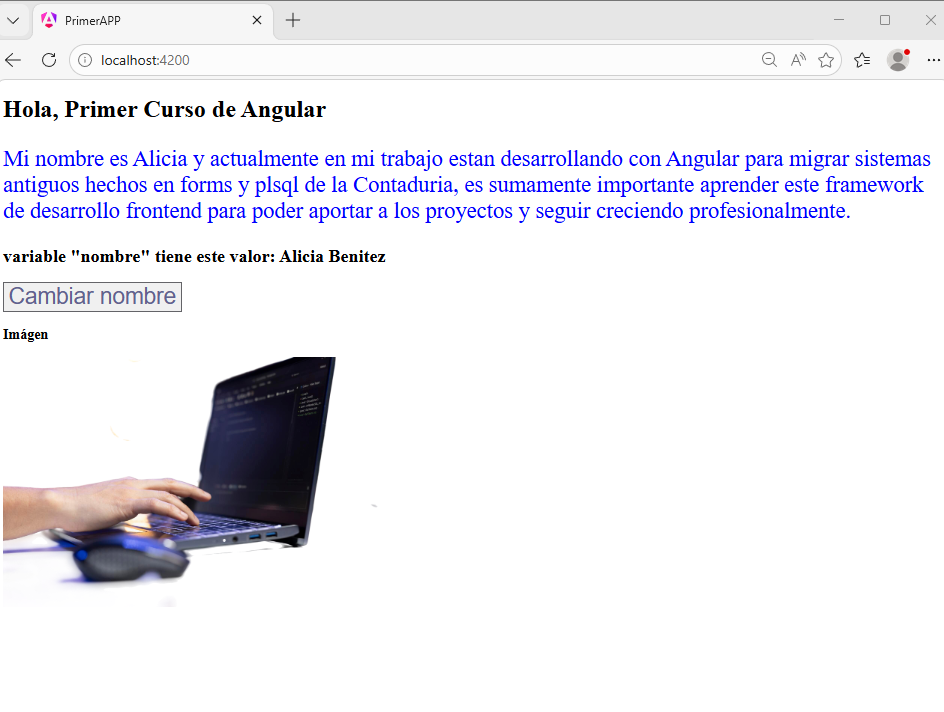
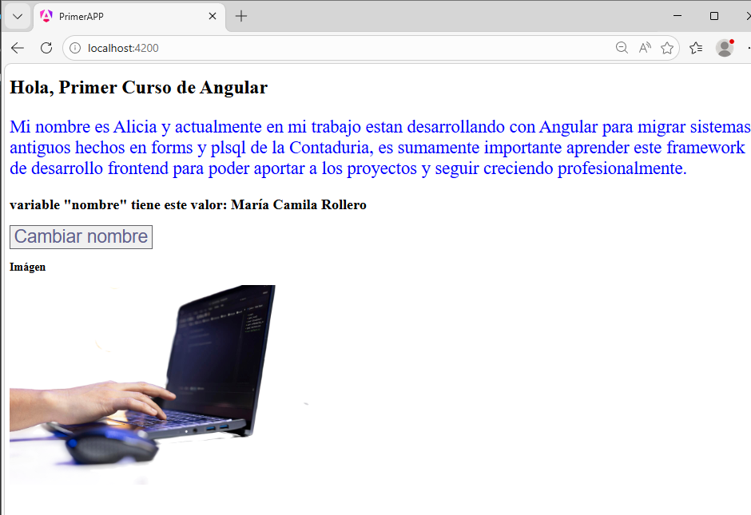

# Mi Primera App en Angular

## Descripción del proyecto
Este proyecto fue realizado como práctica inicial de Angular.  
El objetivo fue aprender a crear una aplicación utilizando Angular CLI, comprender la estructura básica del framework y realizar modificaciones simples en la vista mediante interpolación de variables.

La aplicación incluye:
- Cambio del título principal.
- Un párrafo de presentación personal.
- Uso de interpolación de variables.
- Imagen agregada desde la carpeta `assets`.

---

## Tecnologías utilizadas
- Angular 21
- TypeScript
- HTML
- CSS
- Node.js
- Angular CLI

---

## Estructura principal del proyecto

### `src/app`
carpeta base de la aplicación con los componentes , modulos y la logica principal ,es el núcleo de la aplicación. Allí se encuentra el módulo principal (AppModule) y el componente raíz (AppComponent).

### `app.component.ts`
 Archivo que es el componente principal, que actúa como contenedor raíz de la aplicación. Este componente se asocia a la etiqueta <app-root> que se encuentra en index.html.Es un archivo de clase TypeScript donde se define la lógica del componente.

### `app.component.html`
Plantilla HTML del componente principal.

### `app.module.ts`
Módulo principal de Angular donde se registran los componentes y configuraciones básicas.

### `assets/`
Carpeta pública para recursos estáticos como imágenes, íconos o fuentes..

### `environments/`
Carpeta que contiene archivos de configuración para distintos entornos ( desarrollo , produccion, etc)


### `app.module.ts/`
Es el módulo raíz (AppModule) que agrupa todos los componentes, servicios y dependencias de la aplicación. A la par, define qué componentes se cargan y qué módulos se importan.


---

## Instalación y ejecución

### 1. Clonar el repositorio
```bash
git clone https://github.com/abenitezS/primerAPP.git
```

### 2. Entrar a la carpeta del proyecto
```bash
cd primerAPP
```

### 3. Instalar dependencias
```bash
npm install
```

### 4. Ejecutar la aplicación
```bash
ng serve
```

### 5. Abrir en el navegador
Ir a:
```bash
http://localhost:4200
```

---

## Funcionalidades implementadas

- Creación del proyecto con Angular CLI.
- Modificación del título principal.
- Agregado de texto personalizado.
- Interpolación de variables en la plantilla.
- Uso de imágenes desde `assets`.

---

## Capturas de pantalla

### Pantalla principal
Captura de la aplicación funcionando.

      
  
Cuando presiono el boton "Cambiar nombre" cambia la variable "nombre"

 

---

## Autor

- Nombre: Alicia Graciela Benitez Samaniego
- Curso: Angular
- Unidad: Módulo 1 - Unidad 1

---

## Bibliografía y fuentes

### Documentación en linea
Angular [Bienvenido al tutorial de Angular]. https://angular.dev/tutorials/learn-angular
Angular. The Angular CLI. https://angular.dev/tools/cli
Angular.  Anatomy of a component .https://angular.dev/guide/components

### Libro
- Freeman, A. *Pro Angular 9*. Apress, 2020.

### Créditos de imágenes
- Imagen utilizada desde recursos  libres de uso.
 https://www.magnific.com/es/foto-gratis/codigo-software-computacion-personal-portatil_197081554.htm#fromView=keyword&page=1&position=3&uuid=2dfb358c-dcab-4f6f-981e-21097f7e61cf&query=Angular+web


